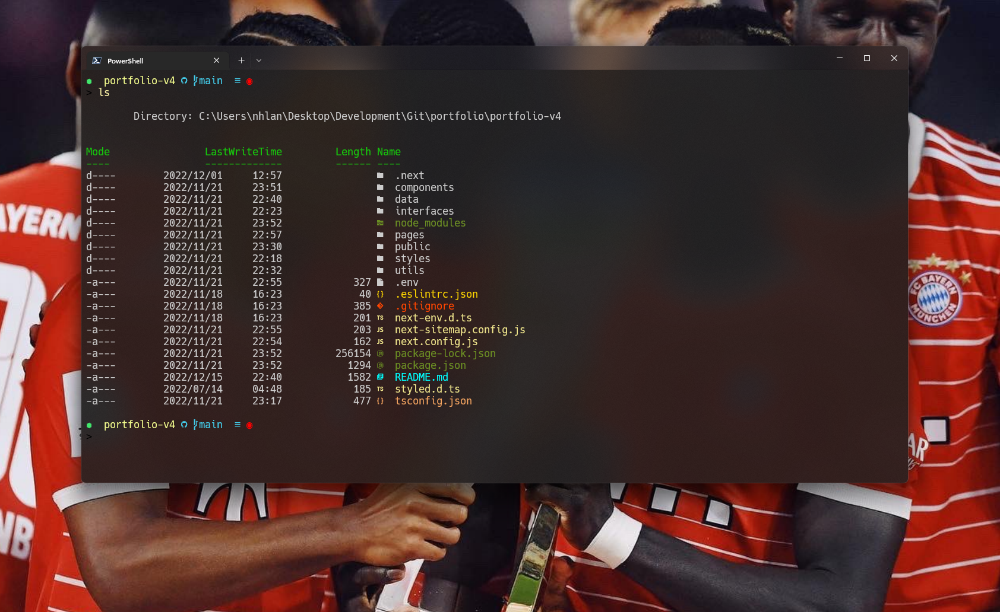
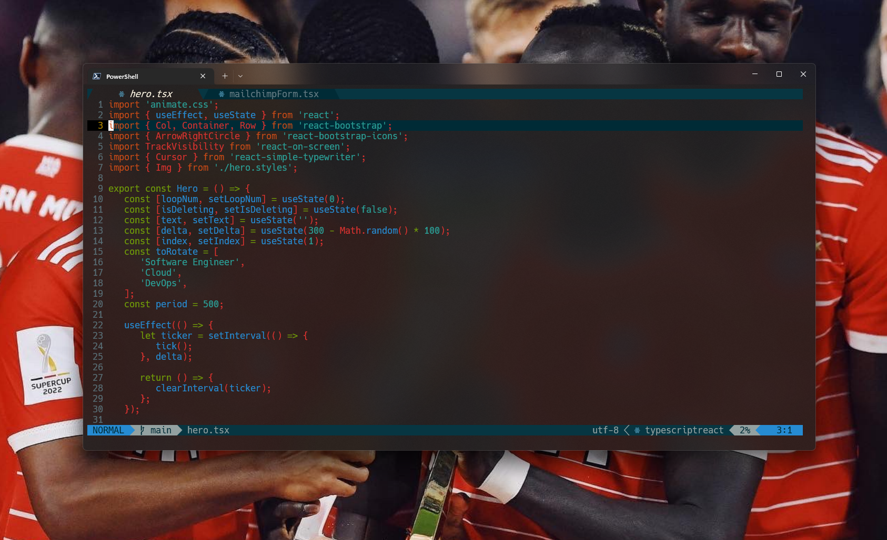
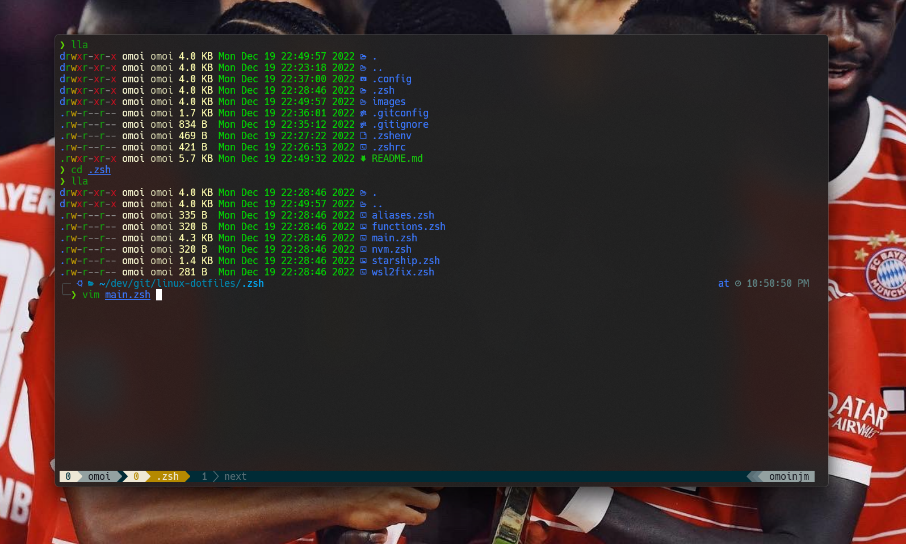
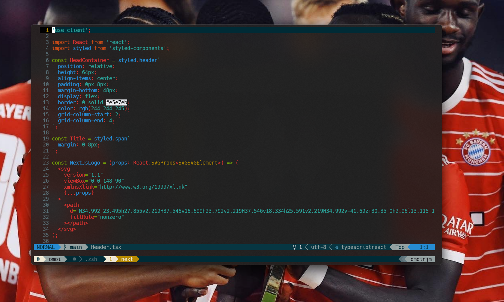

# Personal dotfiles

Cross-platform configs for Fish, Neovim (LazyVim), tmux, lazygit, Linux shells, and Windows PowerShell.

`POWERSHELL`


`NEOVIM`


`ZSH`


`TMUX`


## Repository layout

```
dotfiles/
├── home/.config/          # Portable app configs (symlinked into ~/.config)
│   ├── fish/
│   ├── nvim/
│   ├── tmux/
│   └── lazygit/
├── platform/
│   ├── linux/shell/       # bash and zsh
│   ├── linux/scripts/     # OS-specific automation
│   └── windows/           # PowerShell, Terminal, VS Code, starship
├── secrets/               # Example templates only — never commit real values
├── install/               # Bootstrap and symlink scripts
└── tests/                 # CI checks
```

| Path | Purpose |
|------|---------|
| `home/.config/` | XDG configs shared across machines |
| `platform/linux/` | Linux-only shell and script setup |
| `platform/windows/` | Windows-only PowerShell and app settings |
| `secrets/` | Copy these examples locally and fill in your values |

## Quick start

### 1. Clone the repo

```bash
git clone https://github.com/omoinjm/.dotfiles.git ~/dotfiles
cd ~/dotfiles
```

### 2. Link configs into your home directory

```bash
./install/install.sh
```

This runs `install/link.sh`, which symlinks `home/.config/<app>` into `~/.config/<app>` for:

- `fish`
- `nvim`
- `tmux`
- `lazygit`

Link only what you need:

```bash
./install/link.sh fish nvim
```

If a target already exists as a real directory (not a symlink), the script skips it to avoid overwriting your data.

### 3. Set up local secrets

Secrets are **not** stored in git. Copy the examples and edit them on each machine:

```bash
cp secrets/fish/secrets.fish.example ~/.config/fish/conf.d/secrets.fish
cp secrets/fish/ssh.fish.example ~/.config/fish/conf.d/ssh.fish
```

Fish loads these automatically via `conf.d/00-local.fish`. See [secrets/README.md](./secrets/README.md) for Discord and password-store setup.

### 4. Run tests (optional)

```bash
bash tests/run.sh
```

## Linux and macOS

### Fish

After linking, install plugins with [Fisher](https://github.com/jorgebucaran/fisher):

```fish
fisher update
```

Plugins are listed in `home/.config/fish/fish_plugins`:

- [Fisher](https://github.com/jorgebucaran/fisher) — plugin manager
- [bass](https://github.com/edc/bass) — run bash utilities from fish
- [z](https://github.com/jethrokuan/z) — directory jumping
- [fzf.fish](https://github.com/patrickf1/fzf.fish) — fuzzy finder bindings

Optional shell theme: [Tide](https://github.com/IlanCosman/tide) v5 (`fisher install ilancosman/tide@v5`).

Machine-specific overrides go in `~/.config/fish/config-local.fish` (gitignored). Create it by copying patterns from `config-linux.fish`, `config-osx.fish`, or `config-windows.fish` as needed.

Useful Fish functions:

```fish
sys_cleanup       # clear package manager and app caches
sys_cleanup_due   # run cleanup only once per day
```

### Bash and Zsh

Linux shell configs live under `platform/linux/shell/`. They are not auto-linked — wire them up manually, for example:

```bash
# Bash: source from your ~/.bashrc
source ~/dotfiles/platform/linux/shell/bash/.bashrc

# Zsh: source from your ~/.zshrc
source ~/dotfiles/platform/linux/shell/zsh/.zshrc
```

See [platform/linux/shell/README.md](./platform/linux/shell/README.md) for direnv and symlink notes.

### Neovim

Requires [Neovim](https://neovim.io/) >= 0.9. Config is based on [LazyVim](https://www.lazyvim.org/).

After linking:

```bash
nvim
```

LazyVim installs plugins on first launch. Custom config lives in `home/.config/nvim/lua/`.

### tmux and lazygit

Linked automatically by `./install/install.sh`. Config files:

- tmux: `home/.config/tmux/tmux.conf`
- lazygit: `home/.config/lazygit/config.yml`

## Windows

### PowerShell

Profile entry point: `platform/windows/powershell/user_profile.ps1`

Add to your PowerShell profile (`$PROFILE`):

```powershell
. "$HOME\dotfiles\platform\windows\powershell\user_profile.ps1"
```

Helpers live under `platform/windows/powershell/helpers/`. Discord webhook helpers read from environment variables — see `secrets/discord/env.example`.

### Terminal, VS Code, and WSL

App-specific settings are in `platform/windows/appsettings/`:

- `msterminal/` — Windows Terminal
- `vscode/` — VS Code
- `wsl/` — WSL config

### Starship

Prompt themes: `platform/windows/starship/`

## Secrets and local files

Never commit real credentials. These paths are gitignored:

| File | Purpose |
|------|---------|
| `~/.config/fish/conf.d/secrets.fish` | GPG passphrase and other env secrets |
| `~/.config/fish/conf.d/ssh.fish` | SSH agent socket overrides |
| `~/.config/fish/config-local.fish` | Machine-specific Fish config |
| `~/.config/fish/.last_cleanup_date` | Written by `sys_cleanup` |

Templates and setup instructions: [secrets/README.md](./secrets/README.md)

## Dependencies

### Fish (macOS and Linux)

- [Nerd Font](https://github.com/ryanoasis/nerd-fonts) (e.g. Hack) for prompt icons
- [Oh My Posh](https://ohmyposh.dev/) — loaded in `config.fish`
- [fzf](https://github.com/junegunn/fzf) — fuzzy finder
- Optional: [eza](https://github.com/eza-community/eza), [lsd](https://github.com/lsd-rs/lsd), [colorls](https://github.com/athityakumar/colorls)

### PowerShell (Windows)

- [Scoop](https://scoop.sh/)
- [Oh My Posh](https://ohmyposh.dev/)
- [Terminal Icons](https://github.com/devblackops/Terminal-Icons)
- [PSReadLine](https://docs.microsoft.com/en-us/powershell/module/psreadline/)
- [PSFzf](https://github.com/kelleyma49/PSFzf)

## Migrating from the old layout

If you previously symlinked from `src/config/`:

```bash
cd ~/dotfiles
./install/link.sh fish nvim tmux lazygit
```

Old path → new path:

| Before | After |
|--------|-------|
| `src/config/` | `home/.config/` |
| `src/linux/shell/` | `platform/linux/shell/` |
| `src/windows/` | `platform/windows/` |

## About

- [Twitter @nhlanhlamalaza\_](https://twitter.com/nhlanhlamalaza_)
- [Personal Portfolio](https://njmtech.vercel.app/)
